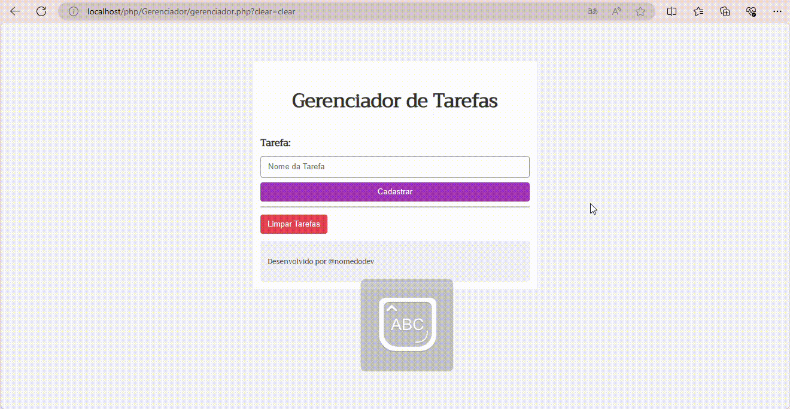

# Atividade-ToDoList

## 📋 Função do site

- Desenvolvido para a matéria de `programação web II` no `Colégio Marista Irmão Acácio`, apresento a atividade proposta para meu melhor desenvolvimento que foi realizado com base nas linhas de códigos, pelas quais atribuo creditos ao criandor e canal [Monolito PHP](https://www.youtube.com/@monolitophp360/videos).
   Este código tem como sua função base, organizar tarefas do dia a dia do usuário, onde o mesmo pode organizar sua rotina, listar seus a fazeres e remove-los após finalizar.

    

## 🖇️ Explicação do código
   Nesta atividade apresento dois arquivos, um em PHP e o outro em CSS. Em PHP houve a ultilização de HTML5 onde foram desenvolvidas as funções de adicionar e remover tarefas. Já em CSS efetuou-se a estilização do visual estetico da página.

   `Funções presentes no PHP`

- `Isset` no PHP serve para saber se uma variável está definida ela verifica a existência de uma variável, e assim, retorna um valor. caso uma variável não esteja definida, ela possui o valor nulo (null).`

- `session_start()` é usada para que seu código tenha acesso à variável de sessão $_SESSION ou inicia uma nova sessão. É como dizer ao servidor que quer acesso à sessão deste usuário.

- `$_SESSION` é utilizado para ler e gravar as informações da respectiva sessão, lendo os dados do arquivo da sessão. A função só existirá quando o session_start() for chamado anteriormente.

- `foreach` é uma estrutura de repetição da linguagem, utilizada no PHP facilita a iteração de algumas estruturas. Como resultado ele percorrerá todos os itens da coleção, disponibilizando a chave e o valor de cada elemento.

- `array` no PHP é um mapa ordenado que relaciona valores a chaves. Está função é otimizado para vários usos diferentes: ele pode ser tratado como um array, uma lista (vetor), hashtable (que é uma implementação de mapa), entre outros.

- `$_GET` é utilizada para recuperar dados enviados para o servidor através da URL. Esses dados são visíveis na própria URL.

- `array_push()` permite que você adicione elementos ao final de um array podendo adicionar quantos elementos quiser. Essa função também pode existir em outras linguagens de programação, como Java, JavaScript, dentre outras. Mantendo a mesma função independentemente da linguagem ele retorna o novo número de elementos do array. 

- `var_dump()` mostra uma informação estruturada sobre uma ou mais expressões, incluindo o tipo e o valor da variável.

- `unset` serve apenas como uma conversão para tipo NULL e não altera a variável que ela está convertendo. ela se tornou-se defasada a partir do PHP 7.2. 0, e foi removida a partir do PHP 8.0.

### 🛠️ Tecnologias Utilizadas

- github
- HTML5
- PHP
- CSS

## 👀 Site Funcionando

## ✒️ Creditos ao criador

[Monolito PHP](https://www.youtube.com/@monolitophp360/videos)  
[video](https://www.youtube.com/watch?v=dJ49I-QYYUk&ab_channel=MonolitoPHP)

 `Digitalização para esse github por`  
[ Emilly Caroline ](https://github.com/emillycaaroline) 
[linkedin](https://www.linkedin.com/in/emilly-caroline-129936290/recent-activity/all/)
